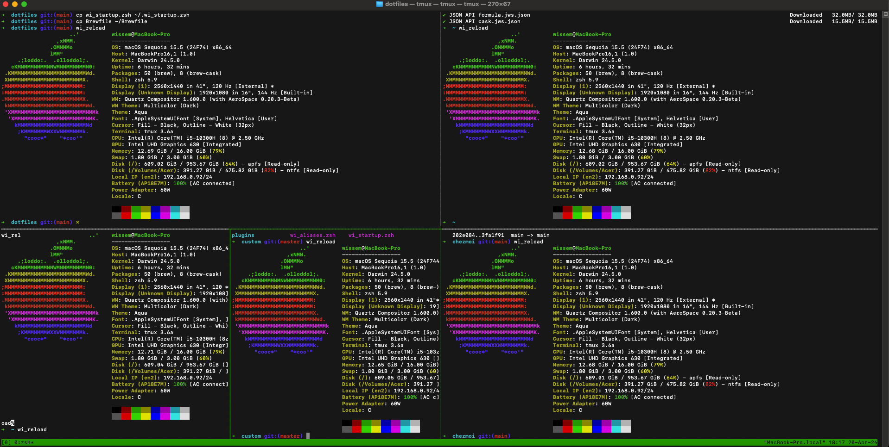

# Wissem's Dotfiles

My personal configuration files for a consistent and productive development environment on macOS, managed with `chezmoi`.




---

## Table of Contents

- [Prerequisites](#prerequisites)
- [Software Stack](#software-stack)
- [Installation](#installation)
- [Configuration Maintenance](#configuration-maintenance)
- [Cheatsheets](#cheatsheets)

---

## Prerequisites

Before installing these dotfiles, ensure you have the following installed on your macOS machine:

| Requirement | Description | Command |
| --- | --- | --- |
| **Command Line Tools** | Apple's developer tools | `xcode-select --install` |
| **Homebrew** | Package manager for macOS | `/bin/bash -c "$(curl -fsSL https://raw.githubusercontent.com/Homebrew/install/HEAD/install.sh)"` |

---

## Software Stack

This setup is tailored for macOS and relies on the following software:

| Category               | Tool                                                              |
| ---------------------- | ----------------------------------------------------------------- |
| **Dotfiles Manager**   | chezmoi                                |
| **OS**                 | macOS                             |
| **Window Manager**     | Aerospace (Tiling WM) |
| **Package Manager**    | Homebrew                                      |
| **Shell**              | Zsh                                       |
| **Terminal Multiplexer**| tmux                         |
| **Code Editor**        | Visual Studio Code              |
| **Python Environment** | uv / Python 3.13 |
| **CLI Tools**          | `gh`, `node`, `cmake`, `fastfetch` |

---

## Installation

To set up a new machine with these dotfiles, you need `chezmoi` installed.

```sh
# Install chezmoi with Homebrew
brew install chezmoi

# Initialize and apply the dotfiles from this repository
chezmoi init --apply https://github.com/iwissemben/dotfiles.git
```

This command will clone the repository and apply the configurations to your home directory. The `Brewfile` included in this repository will be used by a `run_` script to install all the necessary applications and tools.

---

## Configuration Maintenance

To keep your configuration up to date across machines, or to safely modify it locally:

### Updating Dotfiles

To see what changes would be made:
```sh
chezmoi diff
```

To update your dotfiles:
```sh
chezmoi update
```

### Modifying Locally

1. **Edit a managed file**: Use `chezmoi edit <file>` (or custom aliases like `wi_config`) to open the file in your `$EDITOR`.
2. **Apply changes**: Run `chezmoi apply` to apply the modified source state to your home directory.
3. **Sync with Git**:
   ```sh
   cd "$(chezmoi source-path)"
   git add .
   git commit -m "Update configuration"
   git push
   ```

---

## Cheatsheets

To quickly remember essential commands and workflows for the main tools, you can refer to the cheatsheets located in the `docs/` directory of this repository.

- Aerospace Cheatsheet
- chezmoi Cheatsheet
- GitHub CLI (gh) Cheatsheet
- tmux Cheatsheet
- uv Cheatsheet